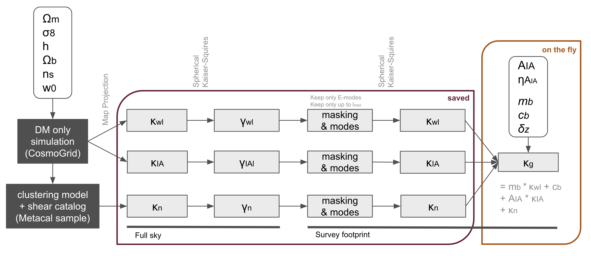

# multiprobe-simulation-forward-model
This repo contains a pipeline to forward model DES Y3 like weak lensing and galaxy clustering maps from the n-body simulations in the CosmoGrid. It is tailored to the [`y3-deep-lss`](https://github.com/des-science/y3-deep-lss) and peak count analysis within the DES collaboration.

### List of tasks ahead
See this [overleaf](https://www.overleaf.com/project/633d2e0525619c7b5a0daf70)

### Installation
The installation should be as easy as 
```
pip install -e .
```
A `requirements.txt` will follow

### Paths
The path to the full sky convergence, intrinsic alignment and galaxy density constrast maps that serve as the input to the pipeline are stored at NERSC at:
```
/global/cfs/cdirs/des/cosmogrid/DESY3
```
Furthermore, the current version of the output `.tfrecord` files can be found on Euler at:
```
/cluster/work/refregier/athomsen/CosmoGrid/DESY3/v2
```

## Overview
The different directories of the repo serve the following purposes:

### configs
Contains the `.yaml` file specifying the constants used throughout the pipeline. These include information on the cosmological parameters like the priors, the definition of the redshift bins, relative paths, and analysis specific choices like the healpix `nside`.

### data
Contains important metadata like information on the cosmological parameters covered by the [CosmoGridV1](http://www.cosmogrid.ai), the survey masks, and catalog ellipticities. The files here are generated by the notebooks in `notebooks/survey_file_gen`, which have to be run first in case one wants to run the pipeline end to end. Note that `DESY3_noise_512.h5` is not saved on github because of its size and has to be generated by running `notebooks/survey_file_gen/noise_file.ipynb`.

### msfm
Contains the main forward model. 

- `msfm/apps` contains the scripts meant to be submitted by [esub-epipe](https://cosmo-gitlab.phys.ethz.ch/cosmo_public/esub-epipe) and are parallelized over the fiducial or grid cosmologies of the [CosmoGridV1](http://www.cosmogrid.ai). Here, the aggregation according to the pipeline picture below is implemented.


- `msfm/utils` contains various helper functions needed in `msfm/apps` 
- `msfm/fiducial_pipeline.py` and `msfm/grid_pipeline.py` contain the generators to efficiently read the `.tfrecord` files and in conjunction with them, form the main product of this repo.

### notebooks
Contains various jupyter notebooks used to develop and debug the pipeline. Apart from the contents of `notebooks/survey_file_gen`, these are not necessary to run the full forward model.

### pipelines
Contains suitable [esub-epipe](https://cosmo-gitlab.phys.ethz.ch/cosmo_public/esub-epipe) submission commands to run the  scripts in `msfm/apps` in a distributed fashion on a CPU computer cluster like Euler.

### scripts
Contains scripts used during development and when debugging and therefore serves a similar purpose as the `notebooks` directory.
