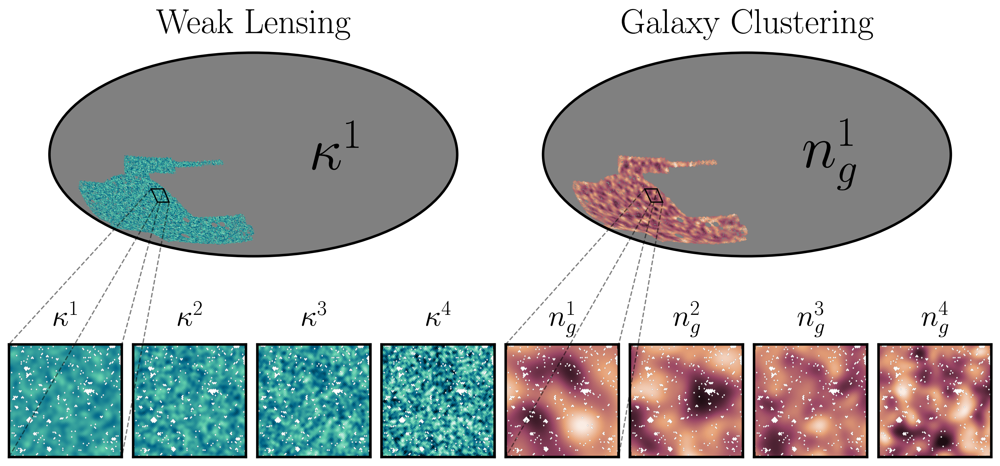

# multiprobe-simulation-forward-model
[](https://arxiv.org/abs/2511.04681)

This repository provides a pipeline to forward model Dark Energy Survey Year 3 (DES Y3)-like weak lensing and galaxy clustering mocks from cosmological simulations:
- **Input:** Full-sky probe maps (weak lensing signal, intrinsic alignments, and dark matter density) from the [CosmoGridV1](http://www.cosmogrid.ai/) simulation suite [[Kacprzak & Fluri et al.](https://arxiv.org/abs/2209.04662)] projected using [`cosmogridv11`](https://github.com/CosmoGridCollab/cosmogridv11)
- **Output:** DES Y3-like maps with realistic survey properties [[Thomsen et al.](https://arxiv.org/abs/2511.04681)]
  - weak lensing (convergence) 
  - galaxy clustering (linear bias) 
- **Deep Learning Integration**: The data storage and loading are designed to work in conjunction with the training pipeline for mutual information maximizing graph convolutional neural networks in [`y3-deep-lss`](https://github.com/des-science/y3-deep-lss)



## Installation

Install the package in editable mode with all dependencies:
```bash
pip install -e .
```

#### Requirements
- Python >= 3.8
- Existing installation of `TensorFlow` (to ensure GPU support on HPC clusters)
- All additional dependencies are automatically installed from `pyproject.toml`

## Repository Structure
The directories of the repo serve the following purposes:

### `configs`
Configuration files specifying the constants used throughout the pipeline. These include information on the cosmological parameters like the priors, the definition of the redshift bins, relative paths, and analysis specific choices like the healpix resolution or linear bias parametrization.

### `data`
Metadata like CosmoGridV1 settings, the survey masks, and catalog ellipticities. The files here are generated by the notebooks in `notebooks/analysis_file_gen`, and are a prerequisite to running the pipeline. Note that `DESY3_noise_512.h5` is not stored on GitHub due to its filesize and has to be generated by running `notebooks/analysis_file_gen/noise_file.ipynb`.

### `msfm`
Main python code 

- `msfm/apps` scripts meant to be submitted by [`esub-epipe`](https://cosmo-gitlab.phys.ethz.ch/cosmo_public/esub-epipe) and are parallelized over the fiducial (plus finite-difference derivates) or grid cosmologies of the CosmoGridV1 to generate `.tfrecord` files. 
- `msfm/utils` various helper functions 
- `msfm/fiducial_pipeline.py` and `msfm/grid_pipeline.py` contain the generators to efficiently read the `.tfrecord` files for neural network training

### `notebooks`
Development and debugging notebooks.

### `pipelines`
Submission commands for [`esub-epipe`](https://cosmo-gitlab.phys.ethz.ch/cosmo_public/esub-epipe) to execute the scripts in `msfm/apps` in a distributed fashion on a HPC CPU cluster.
